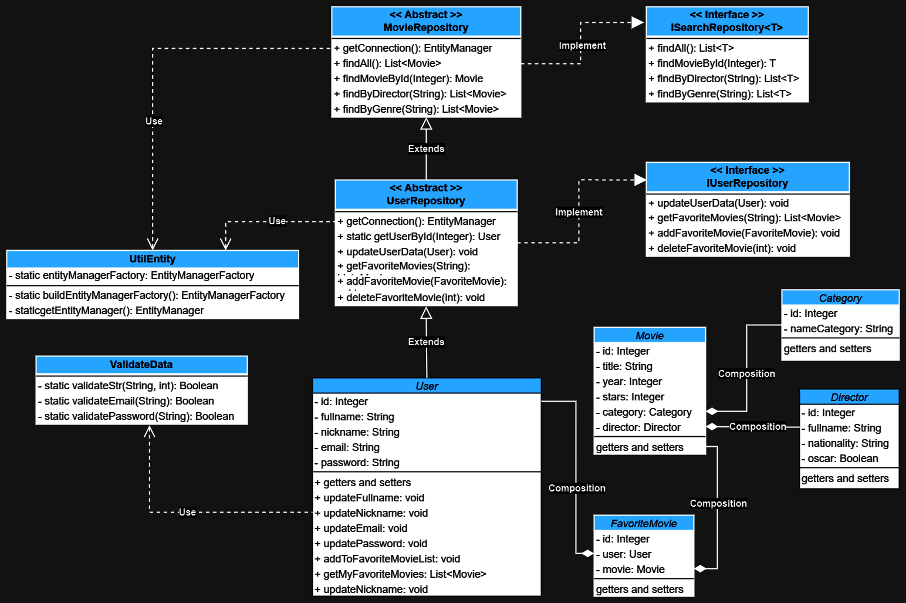
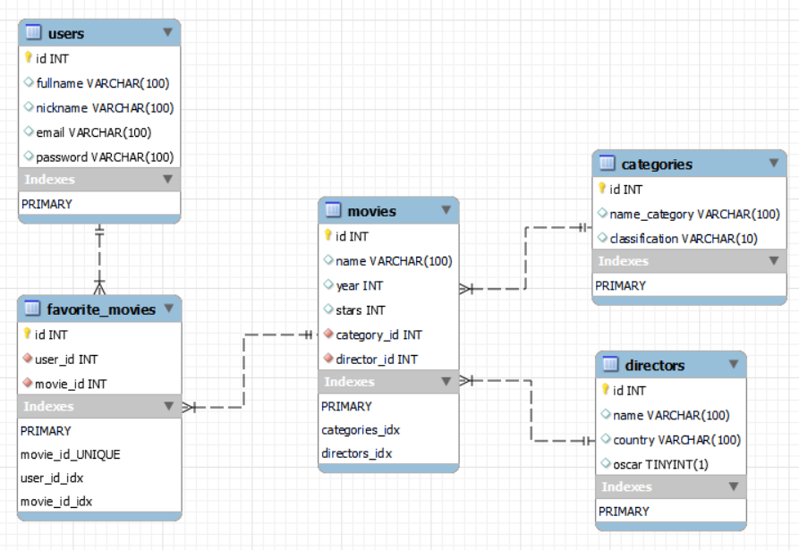

# Movie streaming platform

### Descripción
En este proyecto tuve como objetivo simular algunas funciones que tiene un usuario en aplicaciones como **Netflix**. Por ejemplo:

- Acceder al catálogo completo de películas.
- Buscar Películas por: nombre, categoría o director. 
- Actualizar datos del usuario como nombre, nickname, email o contraseña.
- Tener una lista de favoritos y poder agregar o quitar películas. 

### Tecnologías usadas

	

- [Descargar Script SQL](resources/StructureDataMoviePlatform.sql).

### ¿Qué aprendí?
 
En este proyecto sin duda he logrado poner en práctica muchísimos conceptos y entre los más destacables fue el uso del paradigma de POO, crear, conectar y modificar una Base de Datos utilizando un ORM, implementar el patrón Repository, el uso de Maven y sobre todo el de superar el Síndrome del impostor, comprendiendo que haciendo es como uno aprende.

## Diagrama UML

## Diagrama ERD
